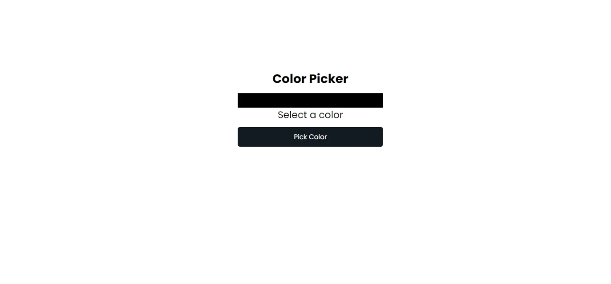

# Color Picker Tool Web Extension

## Overview

This is a Color Picker Tool web extension built with HTML, CSS, and JavaScript that allows users to pick colors directly from the web page and displays their hexadecimal or RGB values. It is simple, lightweight, and designed to help designers, developers, and anyone needing to capture color codes from any website.

[View More Details >>>](https://novalexdroid.github.io/color-picker/)

## Features

- Pick colors from any part of a webpage using a color picker tool.
- Allows users to copy color codes to the clipboard for easy use.
- Minimal and easy-to-use interface, integrated into the browser as an extension.

## Installation

1. Download the extension or clone the repository.
2. Go to your browser's extension page:
   - Chrome: chrome://extensions/
   - Firefox: about:addons
3. Enable Developer Mode (usually at the top right).
4. Click Load Unpacked and select the directory containing the extension files.
5. The Color Picker Tool will now be available on your browser.

## Usage

1. Click on the extension icon in your browser toolbar.
2. The color picker tool will open, and you can hover over any part of a webpage.
3. Click on a color you wish to pick.
4. The selected color's code (Hex) will appear in the tool.
5. You can copy the color code to your clipboard and use it as needed.

## Technologies Used

- HTML: For structuring the popup page and interface.
- CSS: For styling the UI of the color picker tool.
- JavaScript: For handling the color selection, processing color values, and copying to clipboard.

## Example

Here is an example of how the color picker tool appears when opened:

## How It Works

1. User Interaction:
   - The user clicks on the extension icon.
   - The extension's popup opens with a color picker.
2. Color Selection:

   - The user hovers over elements on the webpage to capture the color from that area.
   - Once clicked, the selected color is displayed in both Hexadecimal and RGB formats.

3. Clipboard Support:
   - Users can copy the color values by clicking on a button.

## Contributing

1. Fork the repository.
2. Create a new branch (git checkout -b feature-xyz).
3. Make your changes.
4. Commit your changes (git commit -am 'Add feature XYZ').
5. Push to the branch (git push origin feature-xyz).
6. Open a pull request.

---
